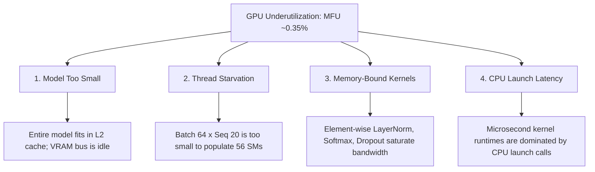

# Remediation Plan: Maximizing Hardware and Training Efficiency

In [`2-training-is-slow.md`](file:///root/inference-engineering-guide/chapter_1_transformers/2-training-is-slow.md), we profiled our basic character-level transformer and diagnosed severe hardware underutilization. Our run on the NVIDIA RTX 4070 Super GPU achieved only **~0.5 TFLOPs/sec** (representing a **~0.35% MFU** against the dense Tensor Core limit). 

To transition into **Chapter 2: Hardware Optimization**, we must move from passive profiling to active optimization. This document outlines the core problems identified and the engineering techniques we will apply to remediate them.

---

## 1. Summary of Identified Bottlenecks



---

## 2. Remediation Strategies

We will apply the following industry-standard deep learning engineering techniques to resolve these bottlenecks:

### Problem A: Model is too small to saturate GPU Capacity
* **Diagnosis**: The 412K parameter model ($\approx 1.65$ MB) resides entirely within the GPU's 48 MB L2 cache, hiding global VRAM bandwidth limitations, and features tiny matrices that underutilize ALU pipelines.
* **Remediation**:
  1. **Scale Up Model Dimensions**: We will increase the hidden size $d_{\text{model}}$ (from 128 to 512) and the number of layers (from 2 to 6).
  2. **Effect**: Scaling dimensions scales the parameters quadratically. The model size will exceed the L2 cache capacity, forcing global VRAM (HBM) data transfers. The larger projection matrices will also perform significantly larger Matrix Multiplications (GEMMs), providing a realistic compute profiling target.

### Problem B: Severe Thread Starvation
* **Diagnosis**: A batch size of 64 and sequence length of 20 (1,280 tokens per step) generates too few parallel thread blocks, leaving the RTX 4070 Super's 56 Streaming Multiprocessors (SMs) mostly idle.
* **Remediation**:
  1. **Increase Block Size**: We will scale sequence length from 20 to 256 or 512.
  2. **Increase Batch Size**: We will scale the batch size from 64 to 256 or 512, sizing it to consume a healthy fraction of VRAM.
  3. **Effect**: This increases the work per step from 1,280 tokens to 65,536+ tokens. The resulting thread blocks will saturate the scheduling queues of all 56 SMs, enabling the GPU to hide memory latency by swapping active warps.

### Problem C: Domination of Memory-Bound Operations
* **Diagnosis**: Element-wise kernels (Softmax, GELU, LayerNorm, Dropout) have an arithmetic intensity of $< 1$ FLOP/Byte. The GPU cores spend nearly 100% of their cycles waiting for these VRAM reads and writes.
* **Remediation**:
  1. **Mixed-Precision Training (AMP)**: We will implement Automatic Mixed Precision (`torch.cuda.amp.autocast`). GEMMs will run in FP16 (utilizing the dense Tensor Cores at 142.2 TFLOPs), while loss calculation and master weights remain in FP32.
  2. **Kernel Fusion (`torch.compile`)**: We will compile the model using PyTorch 2.0's compiler (`torch.compile(model)`). 
  3. **Effect**: 
     - AMP speeds up the compute-bound portions by over $4\times$ compared to standard FP32.
     - `torch.compile` uses Triton to automatically fuse adjacent element-wise kernels (e.g. `GELU` + `Dropout` + `Residual Add`) into a single CUDA kernel. This keeps intermediate data on fast on-chip SRAM, eliminating VRAM round-trips and elevating the arithmetic intensity.

### Problem D: CPU-GPU Launch Latency and PCIe Bottlenecks
* **Diagnosis**: Short kernel run times are overshadowed by the 3–10 microsecond latency it takes the CPU to launch each individual GPU kernel, exacerbated by synchronous `to(device)` transfers.
* **Remediation**:
  1. **Remove Inline Synchronizations**: We will remove `torch.cuda.synchronize()` from the training step, allowing the CPU to queue kernel launches asynchronously.
  2. **DataLoader Prefetching**: We will configure `num_workers > 0` and `pin_memory=True` in the PyTorch `DataLoader`.
  3. **Non-Blocking Host-to-Device Copy**: We will copy data to the GPU asynchronously using `inputs.to(device, non_blocking=True)`.
  4. **CUDA Graphs (Optional)**: If execution remains launch-bound, we will wrap the training step using CUDA Graphs to capture the entire launch sequence once and replay it with a single host invocation.

---

## 3. Anticipated Roofline Progression

By applying these optimizations, our execution profile will migrate on the Roofline chart:

```text
Performance (TFLOPs/sec)
  ^
  |=========================================== FP16 Tensor Ceiling (142.2 TFLOPs)
  |                       / . (Target Optimized GEMMs)
  |                      / . 
  |---------------------/--------------------- FP32 Vector Ceiling (35.5 TFLOPs)
  |                    /
  |                   /
  |                  /
  |                 /  * (Current Run: ~0.5 TFLOPs/sec, 85.8 FLOPs/B)
  |                /
  +---------------/-------------------------> Arithmetic Intensity (FLOPs/B)
```

1. **Current Run**: Positioned in the bottom-left. Even though its arithmetic intensity is 85.8 FLOPs/B, CPU launch gaps and thread starvation prevent it from reaching any ceiling.
2. **Scaled Model & Batching**: Moves the GEMMs to the right on the intensity axis and forces hardware execution towards the FP32 ceiling.
3. **AMP & Kernel Fusion**: Moves compute-bound GEMMs to the FP16 Tensor ceiling and shortens memory-bound valleys through compilation fusion.
